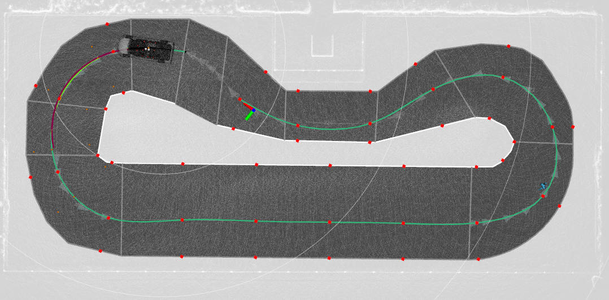

# Lanelets to Path
ROS2 node for converting an Autoware map and route in Lanelet2 format to a reference path represented by a vector of 2D points and two road boundaries, represented by the width to the right and left boundary from the centerline.

## Output format

An Autoware `autoware_auto_planning_msgs::msg::PathWidthLaneId` message with centerline in `points`, distances between points in `heading_rate_rps`, boundaries in `left_bound` and `right_bound` and velocities in `longitudinal_velocity_mps`.


## Installing
All components should be installed automatically using:

`rosdep install --from-paths src --ignore-src -r -y`

## Usage
Use:

```
ros2 launch lanelets_to_path lanelets_to_path.launch
```

Example output:


Red dots denote the centerline points and fitted boundary points. Green line is the fitted reference path.